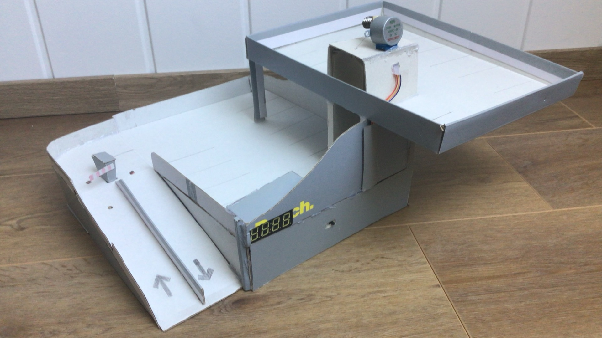

# Arduino Parking Garage System

<p align="center">
  
</p>

## Overview

This system simulates a multi-level parking garage. It detects incoming and outgoing vehicles, controls a barrier gate, tracks available parking spaces, and operates an elevator between two levels.

The number of free parking spaces is displayed in real time using a 4-digit display.

---

## Features

* Automatic barrier control using a servo motor
* Vehicle detection via light sensors (LDR)
* Real-time parking space tracking
* TM1637 4-digit display output
* Elevator system driven by a stepper motor
* Sensor calibration during startup

---

## System Operation

### Vehicle Entry

1. The first sensor detects an incoming vehicle.
2. The barrier opens.
3. A second sensor confirms the vehicle has passed.
4. The barrier closes.
5. The number of free parking spaces is decreased.

### Vehicle Exit

1. The exit sensor detects a vehicle leaving.
2. The number of free parking spaces is increased.

### Elevator

* Controlled via push buttons
* Moves between two levels using a stepper motor

### Display

* Shows the number of available parking spaces
* Displays "FULL" when capacity is reached

---

## Hardware Components

* Arduino board (e.g. Uno)
* Servo motor (e.g. SG90)
* Stepper motor (e.g. 28BYJ-48 with driver)
* TM1637 4-digit display
* 3 × light-dependent resistors (LDR)
* Resistors
* Push buttons
* Breadboard and jumper wires
* External power supply (recommended)

---

## Pin Configuration

| Component      | Pin              |
| -------------- | ---------------- |
| Servo Motor    | D3               |
| Stepper Motor  | D8, D10, D9, D11 |
| TM1637 CLK     | D13              |
| TM1637 DIO     | D12              |
| Elevator Home  | D5               |
| Floor Button 1 | D6               |
| Floor Button 2 | D7               |
| Entry Sensor 1 | A1               |
| Entry Sensor 2 | A2               |
| Exit Sensor    | A3               |

---

## Installation

1. Open the project in the Arduino IDE.

2. Install required libraries:

   * TM1637
   * Stepper (built-in)
   * Servo (built-in)

3. Upload the code to your Arduino board.

---

## Configuration

### Parking Capacity

```cpp
#define ps 23
```

### Sensor Sensitivity

Adjust thresholds in the code depending on ambient lighting conditions:

```cpp
analogRead(A1) < nv1 - 50
```

---

## Limitations

* Light sensors are sensitive to environmental lighting conditions
* Blocking loops (`while`) may affect responsiveness in edge cases
* No hardware debouncing for buttons

---

## Possible Improvements

* Replace LDRs with ultrasonic sensors for more reliable detection
* Add per-slot occupancy indicators (LEDs)
* Upgrade to LCD or OLED display
* Add wireless connectivity (Bluetooth/Wi-Fi)
